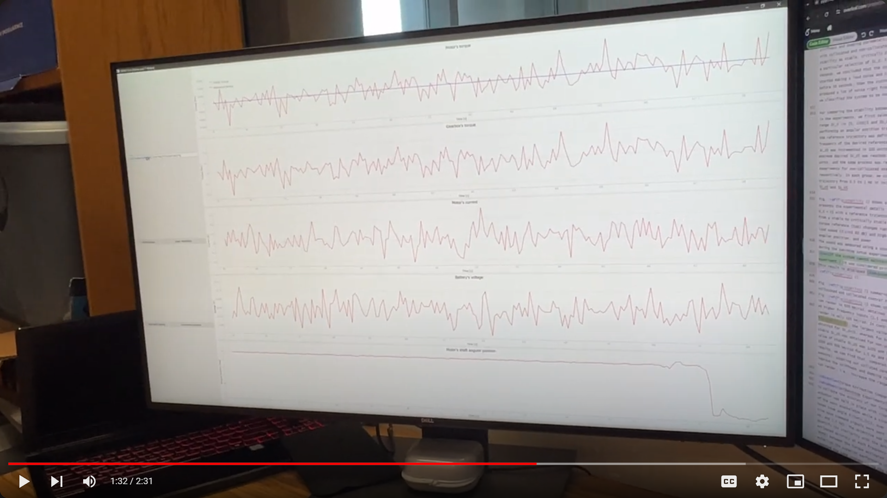

# Torque control for a BLDC motor

Strongly recomend to check the basic documentation before anything

- General: https://docs.odriverobotics.com/v/latest/guides/getting-started.html
- Python package: https://docs.odriverobotics.com/v/latest/guides/python-package.html

The "ODrive_torque_Ctrl.py" file contains the code to perform torque control of a BLDC motor using a ODrive board.

## Hardware Setup and Description

### Motor (Brushless DC)

T-Motor MN4006-23 KV: 380

https://store.tmotor.com/goods-440-Antigravity+MN4006+KV380+-+2PCSSET.html

### Board

ODrive S1

https://odriverobotics.com/shop/odrive-

https://docs.odriverobotics.com/v/latest/hardware/s1-datasheet.html

### Battery (LiPo)

HRB 6S 22.2V 1800mAh 50C

https://hrb-power.com/products/hrb-6s-22-2v-1800mah-100c-lipo-battery-xt60

### USB Isolator v3.6

https://odriverobotics.com/shop/usb-isolator

### Brake resistor

2 Ohm, 50W

https://odriverobotics.com/shop/set-of-8-brake-resistors

# First connection

Strongly recommend to use the ODrive GUI before coding

https://gui.odriverobotics.com/configuration

Input the required parameters in all of the sections
- Power source (related to the specs of the battery)
- Motor
- Encoder (we are using the onboard encoder)
- Control mode (try first the recommendations in there)

Then:

1. Erase old configuration
2. Apply new configuration (will upload the parameters you entered before)
3. Save to non-volatile memory
4. Calibrate (must run the calibration the first time you connect)

After these, you can now go to the Dashboard and see real-time data (angular position, velocity, and current).

You can try different control modes (position, velocity, and torque) to familiarize yourself with how the motor reacts to the input commands.

# To run the Python code

First, install the ODrive tool API (https://docs.odriverobotics.com/v/latest/interfaces/odrivetool.html#install-odrivetool)
~~~ bash
pip install --upgrade odrive
~~~
Once the odrive tool is installed, you can import it into your python code:
~~~ bash
import odrive
~~~
Then, you must use the predefined commands to perform any operation/action with the ODrive board and the motor.

The whole list and description of commands can be found in https://docs.odriverobotics.com/v/latest/fibre_types/com_odriverobotics_ODrive.html

# Brief description of the code

### This is what "PyQtGraph_Test_010.py" do

### Before running the code:

1. Configure all the parameters using the ODrive GUI.

2. Power the ODrive board and wait until a cyan color led turns on.

3. Connect the USB Isolator v3.6 to the device that will run the code.

# Then, execute the code.